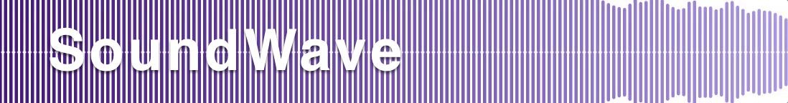
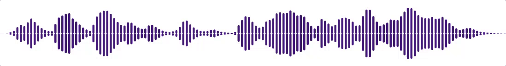

[](https://travis-ci.org/bastienFalcou/SoundWave)
[](http://cocoapods.org/pods/SoundWave)
[](https://github.com/Carthage/Carthage)

[](http://cocoapods.org/pods/SoundWave)

SoundWave is a customizable view representing sounds over time.

## Features

- [x] Add and display audio metering level values on the fly
- [x] Set array of pre-existing audio metering level and play / pause / resume
- [x] Customize background, gradient start and end colors, metering level bar properties, etc.

## Requirements

- iOS 10.0+
- Xcode 10.0+
- Swift 4.2+

## Installation

### CocoaPods

[CocoaPods](http://cocoapods.org) is a dependency manager for Cocoa projects. 

To integrate **SoundWave** into your Xcode project using CocoaPods, specify it in your `Podfile`:

```ruby
pod "SoundWave"
```

Run `$ pod install` to add the framework to your Xcode project.

### Carthage

[Carthage](https://github.com/Carthage/Carthage) is a decentralized dependency manager that builds your dependencies and provides you with binary frameworks. 

To integrate **SoundWave** into your Xcode project using Carthage, specify it in your `Cartfile`:

```ruby
github "bastienFalcou/SoundWave"
```

Run `$ carthage update` to build the framework and drag the built `SoundWave.framework` into your Xcode project.

## Usage

Check out the demo app for an example. It contains the following demos: record sound and display metering levels on the fly, play sound afterwards, resize view, change colors and multiple other properties.

### Adding View

`AudioVisualizationView` can be added to storyboard or instantiated programmatically:

```swift
let audioVisualizationView = AudioVisualizationView(frame: CGRect(x: 0.0, y: 0.0, width: 300.0, height: 500.0)))
view.addSubview(audioVisualizationView)
```

### Customize UI

#### Metering Level Bars 

`AudioVisualizationView` inherits from `UIView` and consequently allows you to change all inherited properties (e.g. `backgroundColor`).

You can change width, corner radius and space inter bars for your graph. This will force the graph to redraw:

```swift
self.audioVisualizationView.meteringLevelBarWidth = 5.0
self.audioVisualizationView.meteringLevelBarInterItem = 1.0
self.audioVisualizationView.meteringLevelBarCornerRadius = 0.0
```

You can change grandient start and end color:

```swift
self.audioVisualizationView.gradientStartColor = .white
self.audioVisualizationView.gradientEndColor = .black
```

> Those variables declared as `IBInspectable` can also be set from Interface Builder.

### Display sound metering levels on the fly


One sound metering level represents the power in decibels of a sound sample. 
First make sure you are in `write` mode: 

```swift
self.audioVisualizationView.audioVisualizationMode = .write
```

Your graph representing metering levels will (re)draw every time you pass a new value on the fly by calling the following.
The value needs to be **between 0 and 1**.

```swift
self.audioVisualizationView.add(meteringLevel: 0.6)
```

> You need to calculate a **percentage** of your decibel values, based on **minimum** and **maximum decibel number** of your recording system. 
> If one value is above 1, the metering level bar will not be fully visible within the bounds of the view.

If you need to reset your graph, just call the following:

```swift
self.audioVisualizationView.reset()
```

### Play existing array of metering levels



The `AudioVisualizationView` can take an array of metering levels to play. Those levels are all gathered in its `meteringLevelsArray` property, array of Float values again **between 0 and 1**.
If there are **not enough** / **too many** values to fit the screen, those values will be respectively **extrapolated** / **clustered** in order to cover nicely the whole width of the screen.

```swift
self.audioVisualizationView.audioVisualizationMode = .read
self.audioVisualizationView.meteringLevels = [0.1, 0.67, 0.13, 0.78, 0.31]
self.audioVisualizationView.play(for: 5.0)
```

Specify the duration of your sound for the view to play exactly at the same pace (and your metering levels fit the sound power heard by the user).

**Note:** you can pause / resume / stop the process by calling:

```swift
self.audioVisualizationView.pause()
self.audioVisualizationView.play(for: durationLeft)
self.audioVisualizationView.stop()
```

As said before, you can also reset the view at any point calling `reset()`.

## License

SoundWave is available under the MIT license. See the LICENSE file for more info.
